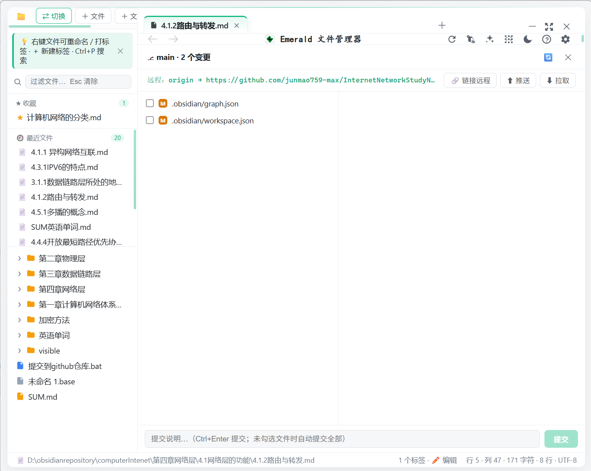

<div align="center">


# Emerald 绿宝石

**本地优先的 Markdown 笔记与文件管理器 · Electron + 原生 JavaScript**

随时随地打开一个文件夹，就是你的知识工作区。实时编辑、双向链接、知识图谱、Git 集成、AI 助手与插件系统，全部数据不出设备。


**零框架 · 零打包器 · 零依赖构建** —— 自研 Markdown 解析器与语法高亮器，纯原生实现。

</div>

---

## 目录

- [✨ 特性](#-特性)
- [📸 截图](#-截图)
- [🚀 快速开始](#-快速开始)
- [🧭 功能导览](#-功能导览)
- [⌨️ 快捷键](#️-快捷键)
- [🧩 插件系统](#-插件系统)
- [🤖 AI 助手](#-ai-助手)
- [🛠️ 技术栈](#️-技术栈)
- [📦 打包发布](#-打包发布)
- [📁 项目结构](#-项目结构)
- [⚠️ 安全与隐私](#️-安全与隐私)
- [📄 文档](#-文档)
- [📝 License](#-license)

---

## ✨ 特性

| | 特性 | 说明 |
|---|---|---|
| 📝 | **Obsidian 风格实时编辑器** | 所见即所得；**行渲染**：点击任意行即显示原生 Markdown 行编辑器，↑↓ 移动编辑行 |
| 🔗 | **双向链接 + 反链** | `[[wikilink]]` 跨笔记跳转，反链面板查看谁引用了本文档 |
| 🕸️ | **知识图谱** | Canvas 力导向布局，拖拽 / 缩放 / 孤岛检测，笔记关系一目了然 |
| 🔍 | **全文搜索** | 文件名 + 内容双通道，命中行高亮，Ctrl+P 即搜即开 |
| 🏷️ | **标签系统** | 文件 / 文件夹打标签，侧栏按标签过滤 |
| 📑 | **大纲导航** | 自动提取标题，点击跳转 |
| ▥ | **多面板分屏** | 双面板独立编辑，拖拽文件到渲染区即可分屏 |
| ⎇ | **Git 集成** | 变更徽章、单文件 diff、暂存 / 提交 / 推送 / 拉取 |
| ✨ | **AI 助手** | BYO-Key（DeepSeek / OpenAI / Ollama），自动附带当前笔记上下文，流式输出 |
| 🧩 | **插件系统** | iframe 沙箱隔离用户脚本，内置本地插件商店 |
| 🖼️ | **图片 / PDF 预览** | 内置查看器，无需跳转 |
| 🎨 | **主题系统** | 亮色 / 暗色 / 跟随系统，翡翠配色 |
| 💾 | **会话恢复** | 启动还原工作区、标签页与光标位置 |
| 📤 | **拖放打开** | 从资源管理器拖文件 / 文件夹直接打开，支持 zip 管理器 |
| ⚡ | **批量重命名** | 序号 / 正则模板，冲突预览 |

## 📸 截图

**应用主界面** —— 工作区、实时编辑器与侧栏：

<p align="center"></p>

**知识图谱** —— 笔记双向链接可视化：

<p align="center"></p>

**Git 变更面板** —— 变更列表 / 差异 / 提交：

<p align="center"></p>

**设置面板** —— 分区化设置与插件管理：

<p align="center"></p>

## 🚀 快速开始

### 环境要求

- [Node.js](https://nodejs.org/) ≥ 20（推荐 24）
- npm（随 Node 安装）

### 克隆并运行

```bash
git clone https://github.com/yourname/emerald.git
cd emerald
npm install
npm start
```

### 或直接使用打包版

下载 `dist/` 下的便携版，解压后双击 `Emerald.exe` 即可运行，无需安装 Node 环境。

### 首次使用

1. 点击 **打开文件夹**（或直接把文件夹拖进窗口）作为工作区
2. 左侧目录树点击文件打开；Markdown 实时编辑
3. 右上角 **❓** 随时查看完整使用帮助（快捷键 / 功能导览）

## 🧭 功能导览

### 编辑器

Markdown 采用 **实时渲染 + 行级编辑（Obsidian 风格）**：整篇以渲染态展示，点击任意行，该行立即变为原生 Markdown 行编辑器（其余行保持渲染），`Enter` 提交 / `Esc` 取消 / `↑↓` 移动编辑行。支持任务列表勾选回写、`[[wikilink]]` 跳转、`⌨` 标注的代码块与圆角表格；右键菜单提供**插入内部笔记链接**（输入笔记名搜索选择）与标题 / 分割线等快捷插入。

### 分屏

编辑器标题栏 **▥** 按钮开启第二面板；或把左侧目录树中的文件拖到渲染区右侧，出现绿色阴影预览后松手即分屏打开。

### Git 集成

打开工作区即扫描 Git 状态，目录树显示 `M / A / U / D / R` 徽章。Git 面板提供：变更列表、单文件 diff、暂存 / 取消暂存、提交（自动 `git add -A`）、初始化仓库、链接远程与推送 / 拉取。

### 知识图谱

扫描工作区全部 Markdown 解析 `[[wikilink]]`，Canvas 力导向布局：拖拽节点重排、滚轮缩放、点击节点打开笔记；孤立节点单独标记；缩放自动隐藏标签（Obsidian 风格）。

### AI 助手

- 标题栏 ✨ 图标打开面板，右上角 ⚙ 配置服务商 / 模型 / API Key
- **Key 用系统安全存储（safeStorage）加密**，仅存主进程，绝不进入渲染进程
- 提问自动附带当前打开笔记；编辑器划选文本后点 AI 优先使用选区
- 支持 DeepSeek / OpenAI / Ollama 本地模型，SSE 流式输出

### 搜索

`Ctrl+P` 快速切换器：输入文件名或内容关键字，实时结果，Enter 打开。`Ctrl+F` 在编辑器内查找 / 替换。

## ⌨️ 快捷键

| 快捷键 | 功能 |
|---|---|
| `Ctrl + P` | 搜索文件 / 内容 |
| `Ctrl + Shift + P` | 命令面板（所有功能统一入口） |
| `Ctrl + S` | 保存当前文件 |
| `Ctrl + F` | 查找 / 替换 |
| `Ctrl + W` | 关闭当前标签 |
| `Ctrl + Tab` / `Ctrl + Shift + Tab` | 循环切换标签 |
| `Ctrl + Enter` | 提交块编辑（实时模式） |
| `Esc` | 关闭浮层 / 退出块编辑 |

> 完整列表见应用内 **❓ 使用帮助**。

## 🧩 插件系统

**沙箱隔离**：每个插件运行在 `<iframe sandbox="allow-scripts">` 中（无同源权限），只能通过注入的 `emerald` 桥调用受限 API 与主应用通信，无法触碰应用 DOM 与全局状态。

**插件位置**（`.js` 文件，自动加载）：

```
用户数据目录\plugins\            # 全局插件（所有工作区）
工作区\.emerald\plugins\         # 项目插件（仅当前工作区）
```

**示例插件**：

```js
emerald.registerCommand({
    id: 'demo.date',
    label: '插入今天日期',
    run() {
        const d = new Date()
        emerald.insertAtCursor(d.getFullYear() + '-' + (d.getMonth() + 1) + '-' + d.getDate())
    },
})
```

**API 一览**：`registerCommand` / `showNotice` / `getCurrentFile` / `getWorkspace` / `openFile` / `readFile` / `writeFile` / `readDir` / `insertAtCursor` / `log`（文件 API 仅允许访问当前工作区内路径）。

**插件商店**：设置 → 插件商店，内置 Emoji 助手、日期插入器、笔记统计、Frontmatter 元数据、笔记备份 5 个插件，一键安装 / 卸载。

## 🤖 AI 助手

BYO-Key 设计（自带 API Key），数据不出设备：

| 服务商 | baseUrl | 模型示例 |
|---|---|---|
| DeepSeek | `https://api.deepseek.com` | `deepseek-chat` |
| OpenAI | `https://api.openai.com/v1` | `gpt-4o-mini` |
| Ollama（本地） | `http://localhost:11434/v1` | `qwen2.5` |

## 🛠️ 技术栈

| 层 | 技术 |
|---|---|
| 桌面壳 | **Electron 43**（`contextIsolation: true`，无边框窗口） |
| 语言 | **原生 JavaScript**（ES2022，`type: commonjs`） |
| UI | 纯 HTML + CSS 变量主题（亮 / 暗 / 跟随系统） |
| Markdown | 自研 `md-parser.js`（块级解析 + 安全转义） |
| 高亮 | 自研 `highlighter.js`（20+ 语言 token 化） |
| 数据 | localStorage（会话 / 偏好）+ `.emerald/index.json`（标签侧车） |
| 安全 | `safeStorage` 加密 Key · iframe sandbox 插件隔离 · 路径白名单 |
| 构建 | 无构建（`<script src>` 直引）；便携版手动打包 |

**设计原则**：无框架、无打包器、无 TypeScript —— 自研解析器与高亮器本身就是项目的核心学习资产。

## 📦 打包发布

提供**免安装便携版**：`dist/Emerald-win32-x64/`（含多尺寸图标，双击运行）。重新打包：

```bash
# 复用本地 Electron 发行版（零额外下载）
robocopy node_modules\electron\dist dist\Emerald-win32-x64 /E
# 应用代码放入 resources\app，删除 default_app.asar
# rcedit Emerald.exe --set-icon emerald.ico   # 注入应用图标
```

## 📁 项目结构

```
emerald/
├── index.js                  # 主进程：窗口 + 全部 IPC（文件 / Git / AI / 插件）
├── preload.js                # contextBridge 安全桥（仅暴露白名单 API）
├── index.html                # 界面 DOM + 样式（CSS 变量主题）
├── renderer/
│   ├── app.js                # 渲染进程逻辑（编辑器 / 分屏 / 图谱 / 面板）
│   ├── md-parser.js          # 自研 Markdown 块级解析器
│   ├── highlighter.js        # 自研语法高亮器
│   ├── plugin-manager.js     # 插件沙箱（iframe + postMessage 桥）
│   └── plugin-store.js       # 内置插件商店
├── icon.png                  # 应用图标源图
├── app-icon.png              # 裁剪放大后的应用 Logo
└── img/                      # README 截图
```

## ⚠️ 安全与隐私

- **AI Key**：safeStorage 加密落盘，主进程持有，渲染进程仅知"是否已配置"
- **插件**：沙箱隔离 + 文件访问限制在工作区内；商店插件经审查后内置
- **数据**：全部存于本地，无任何遥测与云同步；支持导出工作区备份（`.emerald` 索引 + manifest）
- **导航防线**：窗口禁止导航到应用目录之外的本地页面，外链一律交系统浏览器

## 📄 文档

- [项目迭代计划](项目迭代计划.md) —— 从 P0 到 P3 的完整规划与实现记录
- [待办功能](待办功能.md) —— 功能清单与后续可选项

## 📝 License

[MIT](LICENSE) © Emerald

---

<div align="center">

**Emerald** · 让知识管理回归本地 · Made with ❤️ and 原生 JavaScript

</div>
